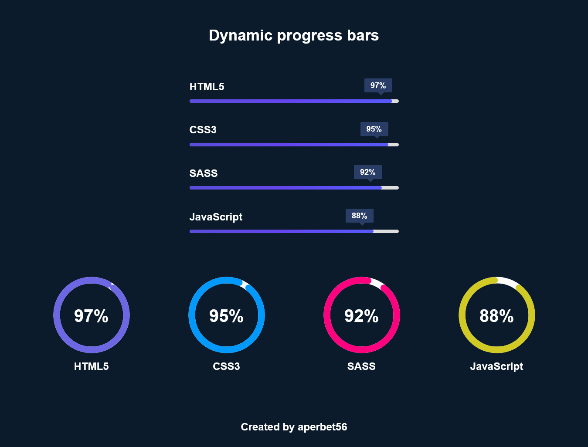

## DYNAMIC PROGRESS BARS

## Le challenge

Mon but a été de créer des barres et cercles de progression qui se remplissent de manière progressive jusqu'à atteindre le pourcentage indiqué grâce à JavaScript.

## Démonstration

Lien vers le projet : https://aperbet56.github.io/dynamic_progress_bar/

## Projet développé avec

- Utilisation des balises sémantiques HTML5
- CSS
- Flexbox
- Animations CSS
- Page web responsive
- Utilisation d'un normaliseur : normalize.css
- JavaScript
- Code JavaScript commenté
- Desktop first
